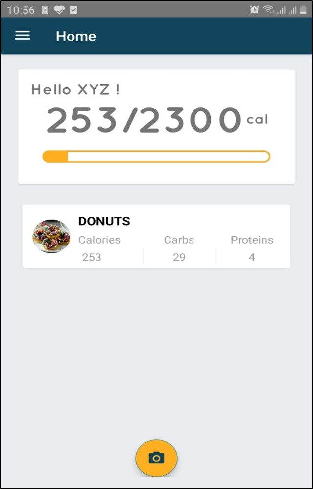

# Smart Calories Tracker

Smart Calories Tracker app uses deep learning to automatically find calories from a food and track its usage.

| Italic             |  Block letters |
:-------------------------:|:-------------------------:
  |  
  |  
  |  
  |
